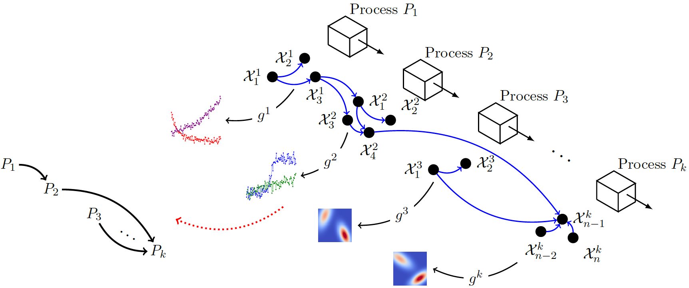

# Professional Projects

## Image-Miner
In Image-Miner we are learning causal relations from artificially generated high-dimensional production line data. 
For this we designed image generator functions that generate images based on a DAG where causal relations are known.
We learn the causal relations between the images back from the images/ timeseries data.
This research serves to establish concepts applicable to real-world production lines.
Manufacturers are particularly eager to pinpoint aspects within their production data, 
that influence whethera part is classified as OK or NOK.

## Lineflow

In our project Lineflow, we are developing a flexible and extensible Python framework for simulating production lines. 
Our simulation can be controlled by an AI. The production line with the state of the cells and the parts as well as
the AI's actions are visualized.
We can use our framework to train an AI that automatically optimizes this production line towards a metric i.e. produced parts. 
The framework will be opensourced on my [GitHub]() soon.

## Masterthesis

My Masters thesis, also under the supervision of Tobias Windisch, 
focused on the optimization of production lines at Robert Bosch GmbH. I 
created a production line simulation using Python allowing me to simulate and 
predict potential line jams in advance using machine learning.

## Teaching
Furthermore, I am actively involved in academia, where I have the privilege of supervising students in a lecture dedicated to the use of AI in production systems.

# University Projects
A selection of my University Projects

## Development of a Inbuild LED visualization for a Driving Simulator
Together in a team of four students, we created a navigation system based on Automotive Grade Linux (AGL) using HTML/CSS/JS. My personal main work was the implementation of the visualization of Navigation Outputs for the driver via a LED Matrix build into the dashboard. For more information, please have a look at my [GitHub](https://github.com/mueller-kai/LED-Matrix-Visualization-for-Driving-Simulator/tree/main)

<video id="video-driving-simulator" loop="" muted="" class="img-fluid" alt="Visualization of Driving simulator" style="border-radius:15px" width="60%" height="auto" controls=""><source src="../media/driving-simulator.mp4" type="video/mp4">Your browser does not support the video tag.</video>

## Creation of a Futuristic Projection of an Automotive Infotainment System in Year 2030
In this project, our team consisting of three students created a concept of an automotive UI in year 2030 based on state-of-the-art literature research. In order to present our research results and our prototype "Casey", we created a project website. In this section, you can see a short screencast delivering an introduction to our website.

My personal focus of this project was researching on the adaption of automotive UIs to the Chinese market. Based on that research, I anticipated novel interaction techniques and UI functions for the Chinese-market in year 2030.
<video id="video-interactive-systems" loop="" muted="" class="img-fluid" alt="Project teaser for the Automotive UI 2030 project" style="border-radius:15px" width="60%" height="auto" controls=""><source src="../media/interactive-systems-presentation-muted-compressed-4MB.mp4" type="video/mp4">Your browser does not support the video tag.</video>

# Personal Projects
## Bantolo
When I find the time I develop a platform called [Bantolo](https://www.bantolo.com) where children who otherwise do not find interest in writing can interactively generate their own book using LLMs and Image Generation models.
